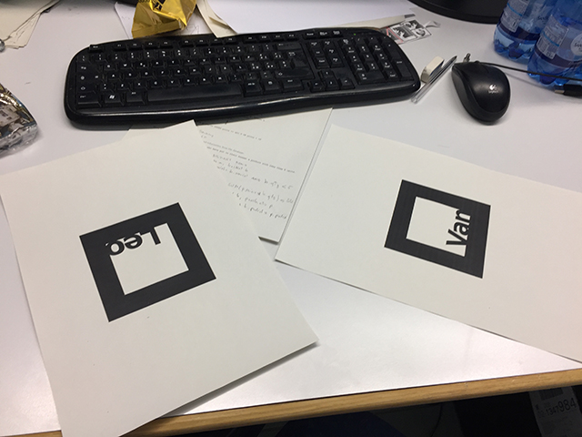
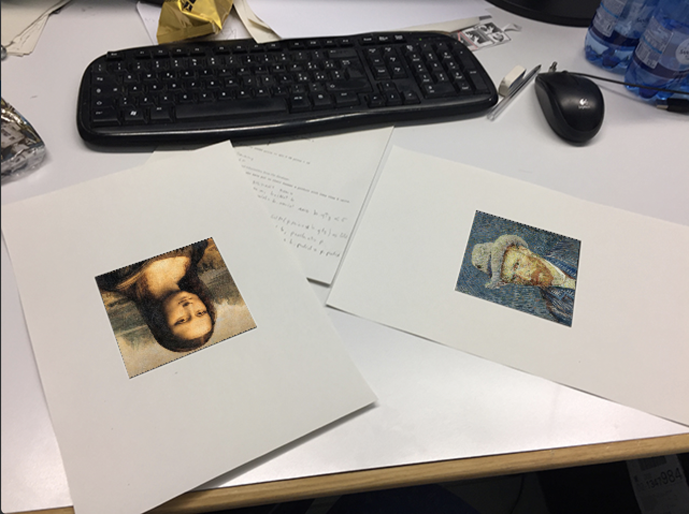

# Pictures AR for Android #

This is a simple example of an Android application which uses the code that I realized for my Computer Vision course project at Ca' Foscari university.

The application is a simple AR software that replaces two markers with the pictures related to them.

In particular Van marker will be substituted with Van Gohg's picture and Leo with Leonardo's picture.

[Original C++ Source code](https://github.com/MarcoSignoretto/PictureAR)

 

### PlayStore application ###

You can download the application directly from play store.

[See PictureAR on PlayStore](https://play.google.com/store/apps/details?id=it.signoretto.marco.picturear)

### Try the application ###

In order to try the application you can print markers on a paper sheet or use the following markers

 

Download the pdf sheets: [Leo Marker](https://github.com/MarcoSignoretto/PictureARAndroid/blob/master/data/0M.pdf), [Van Marker](https://github.com/MarcoSignoretto/PictureARAndroid/blob/master/data/1M.pdf)

## Android Studio OpenCV Setup ##

### Import Java module ###

1. Download the desired version of the OpenCV Android SDK from [OpenCV GitHub page](https://github.com/opencv/opencv/releases)
2. Open Android Studio
3. open: File > New > Import module
4. Choose the ```opencv.3.X.X-android-sdk/OpenCV-android-sdk/sdk/java``` as source location (X.X is the subversion of the OpenCV library)
5. Accept default config and finish module import
6. Change the ```compileSdkVersion``` in the ```build.gradle``` of the imported module (Switch to Project view if you can't see the module in Android Studio)
7. Include module in your app module adding ```implementation project(path: ':openCVLibrary3XX')``` (XX is the subversion of the OpenCV library, example 3.3.1 => 331)

### Import jni OpenCV libraries ###

1. Copy the content of ```opencv.3.X.X-android-sdk/OpenCV-android-sdk/sdk/native/libs``` into ```app/src/main/jniLibs```
2. Add into the ```CMakeLists.txt```, after the ```cmake_minimum_required....```, the following lines
```sh
# OpenCV stuff
include_directories(native/jni/include)
add_library( lib_opencv SHARED IMPORTED )
set_target_properties(lib_opencv PROPERTIES IMPORTED_LOCATION ${CMAKE_CURRENT_SOURCE_DIR}/src/main/jniLibs/${ANDROID_ABI}/libopencv_java3.so)
```
3. Add ```lib_opencv``` to the ```target_link_libraries``` (see application CMakeLists.txt to better understand)

### Project Author ###
Marco Signoretto